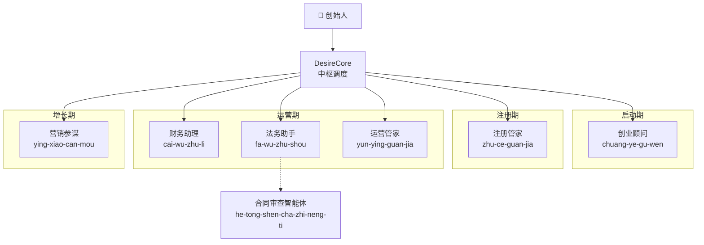
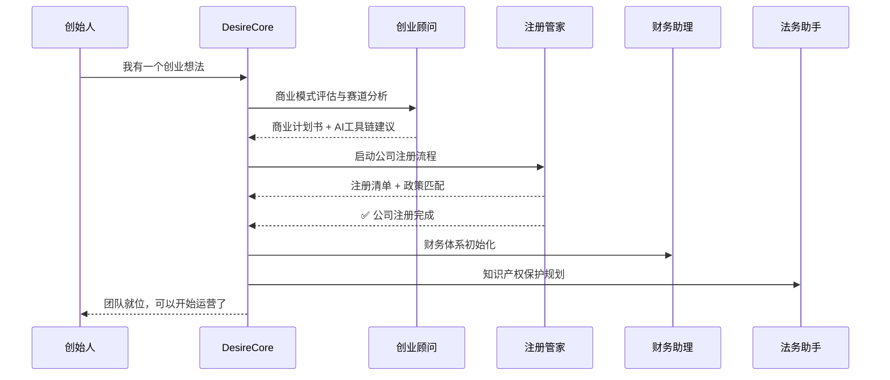
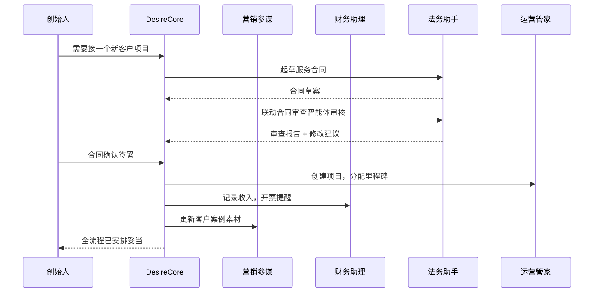

# 🏢 一人公司服务团队（OPC Service Team）

> **团队ID**: opc-service-team
> **组长**: DesireCore（系统中枢调度器）
> **创建时间**: 2026-03-26
> **类型**: 持久群（Persistent）

---

## 团队定位

为一人公司（OPC, One Person Company）创始人提供覆盖**全生命周期**的 AI 智能体服务，从战略规划、公司注册到日常运营、增长获客，一个团队搞定所有事务。

---

## 团队架构

---

## 成员列表

| # | 智能体 | ID | 职能 | 阶段 |
|---|--------|----|------|------|
| 1 | 创业顾问 | `chuang-ye-gu-wen` | 战略规划、商业模式、赛道选择、AI工具链 | 启动期 |
| 2 | 注册管家 | `zhu-ce-guan-jia` | 公司注册、工商税务、资质许可、政策申报 | 注册期 |
| 3 | 财务助理 | `cai-wu-zhu-li` | 记账报税、发票管理、财务报表、成本控制 | 运营期 |
| 4 | 法务助手 | `fa-wu-zhu-shou` | 合同起草、知识产权、数据合规、公司治理 | 运营期 |
| 5 | 营销参谋 | `ying-xiao-can-mou` | 品牌策略、内容营销、社媒运营、增长分析 | 增长期 |
| 6 | 运营管家 | `yun-ying-guan-jia` | 项目管理、客户服务、工作流自动化、日常运营 | 全周期 |

**协作成员**（按需联动）:
- 合同审查智能体 (`he-tong-shen-cha-zhi-neng-ti`) — 法务助手审查合同时可联动

---

## 典型工作流

### 🟢 流程一：从零开始创业

### 🔵 流程二：日常运营支持

---

## 调度规则

### 阶段路由

| 用户意图 | 路由目标 | 说明 |
|---------|---------|------|
| "我想创业/有个想法" | 创业顾问 | 首先进行商业评估 |
| "准备注册公司" | 注册管家 | 进入注册流程 |
| "报税/记账/发票" | 财务助理 | 财务相关事务 |
| "合同/法务/商标" | 法务助手 | 法律事务 |
| "营销/获客/品牌" | 营销参谋 | 市场推广 |
| "项目管理/效率/自动化" | 运营管家 | 运营优化 |

### 协作模式

1. **单点委派** (`delegate sync`): 明确指向某个成员的任务
2. **扇出委派** (`delegate fan-out`): 需要多成员并行意见时
3. **链式委派**: A 成员完成输出后作为 B 成员的输入

### 跨成员联动

- 法务助手 ↔ 合同审查智能体：合同起草后自动送审
- 营销参谋 → 运营管家：营销活动转化为项目任务
- 财务助理 → 创业顾问：月度财务数据反馈商业模式健康度
- 注册管家 → 法务助手 + 财务助理：注册完成后自动初始化法务和财务体系

---

## 团队健康度

| 指标 | 状态 |
|------|------|
| 成员数量 | 6 个核心 + 1 个协作 |
| 团队状态 | ✅ 就绪 |
| 下次巡检 | 按需触发 |
